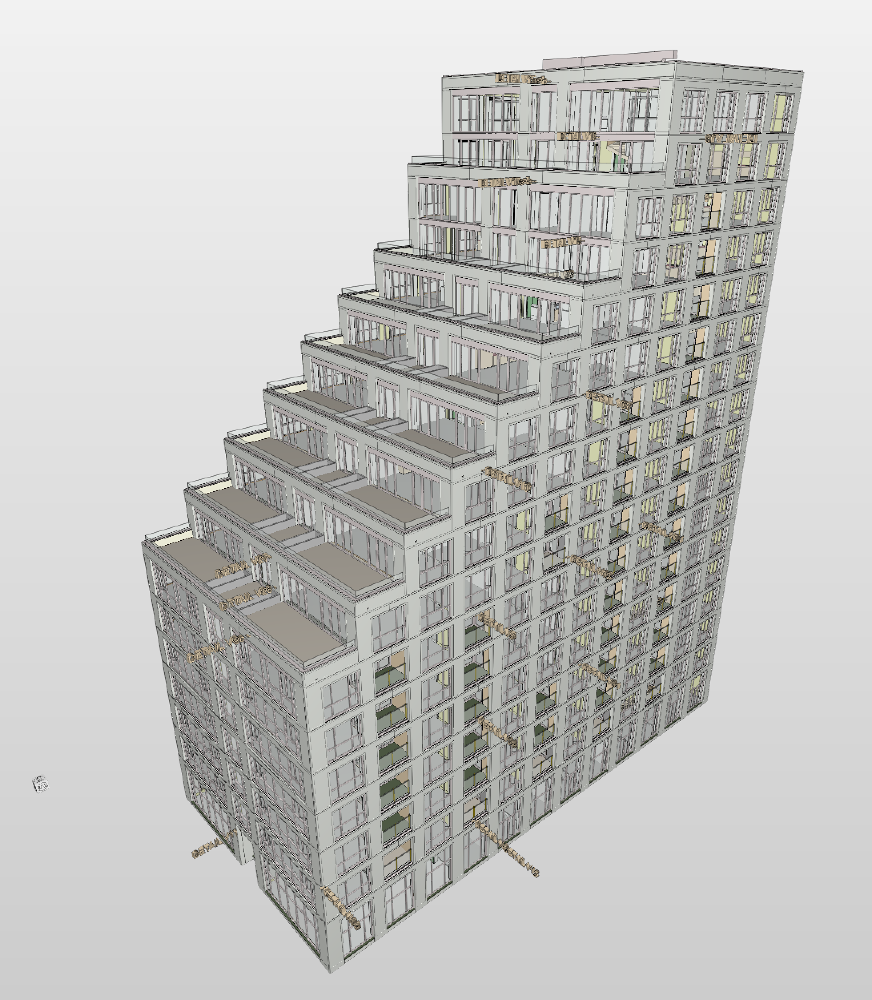

# S1 project 

As we are working closely with universities and other institutes, we found out that there are not enough practical study materials available. After internal discussions with our executive board, we decided that we would like to help you out by providing a dataset. 
We feel that the Sixty5 project, known during its development as Building Field S1, at Strijp-S Eindhoven is ideally suited for this purpose. 
This project has been developed with all the latest digital techniques available at the time, is of a high data quality, is an accessible project, and is in an inspiring location. In summary, we make this dataset available so you may use it for your project, assignment and thesis. 

The following data is included in this dataset:
1.	IFC models
	a.	Design models	
	b.	Engineering model
	c.	Building site design
2.	Floor plans
	a.	Structured based on STABU
3.	BIM agreements
	a.	Note that we did not use BIM Base ILS and O&E for this project
4.	Crane camera scans
	a.	Ground control points
	b.	Pictures
	c.	Point clouds
	d.	Mesh
5.	4D Schedule (planning)

We stimulate everyone to contribute to this dataset. Feel free to share the results of your analysis of this data back, or transform the data to other formats like Linked Data.
We are mainly looking forward to energy analysis, TTL files, IFC metrics, etc. 
If you have any questions regarding the dataset, please contact us!
We wish you all the best with your study and research.

Kind regards,
ir. Selahattin Dülger 
BIM-Coördinator
tel: +31 612179115
www.stamendekoning.nl

# License

(C) original authors
This work is published under the Creative Commons Attribution 4.0 International License. 
More info and a link to the full license text is available on http://creativecommons.org/licenses/by/4.0/

