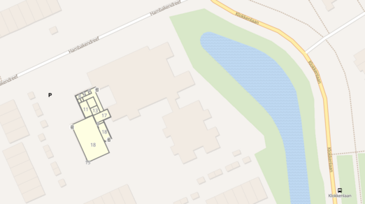

Gymzaal Amersfoort
====================

This is a sports hall in Amersfoort, Hambakendreef 2A, Netherlands, provided to demonstrate geolocation features in IFC4.

The IFC was exported from Revit 2020 with standard RV MVD settings.
In Revit, geolocation in WGS84 was initially determined from the given address and manual positioning on a large scale map.
The Revit IFC exporter then converted the WGS84 location to the Amersfoort CRS - [EPSG 28992](https://epsg.io/28992), 
resulting in a location of the WCS origin (eastings, northings = 149692, 413790) situated on a [green space north of the building](https://epsg.io/map#srs=28992&x=149692&y=413790&z=19&layer=osm).

However, the project base point is at the south most point of the building [almost 100m away](https://www.openstreetmap.org/node/2755155278/?mlat=51.712837012&mlon=5.31039857#map=19/51.71273/5.31019) from the determined location.
For a corrected version, the WGS84 coordinates of the south-west point of the [OpenStreetMap building polygon](https://www.openstreetmap.org/relation/3616732) have been transformed to Amersfoort CRS with [EPSG 4833 reversed](https://epsg.io/transform#s_srs=4326&t_srs=28992&ops=4833).
Further, issues with units from the original IFC Exporter version have been corrected manually.

Image source: [© OpenStreetMap contributors](https://www.openstreetmap.org/copyright), [Project LevelOut](https://bauinformatik.github.io/levelout/)

