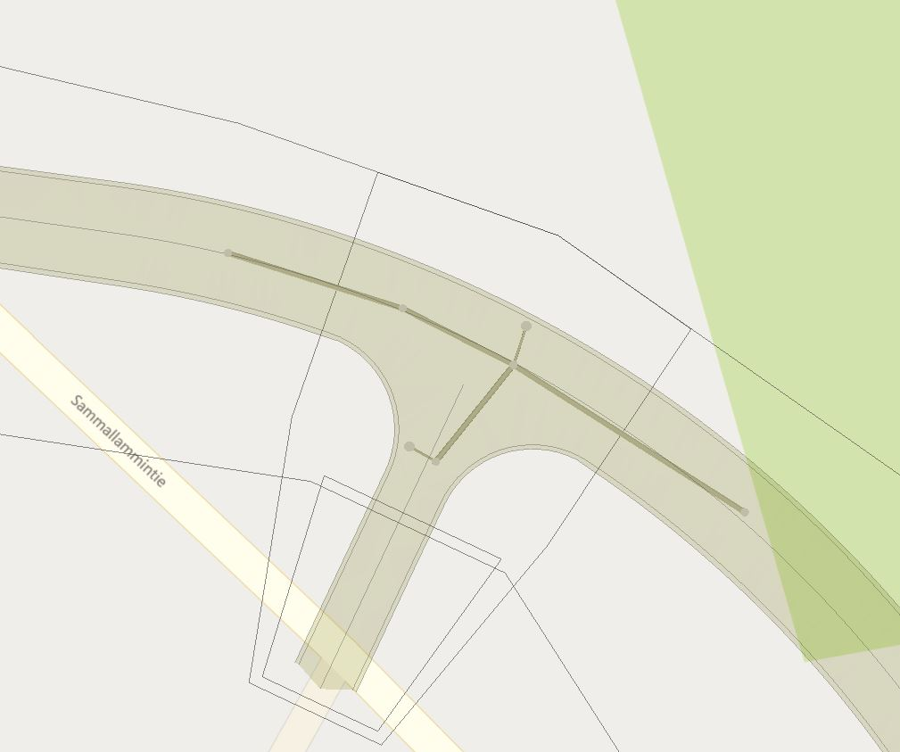
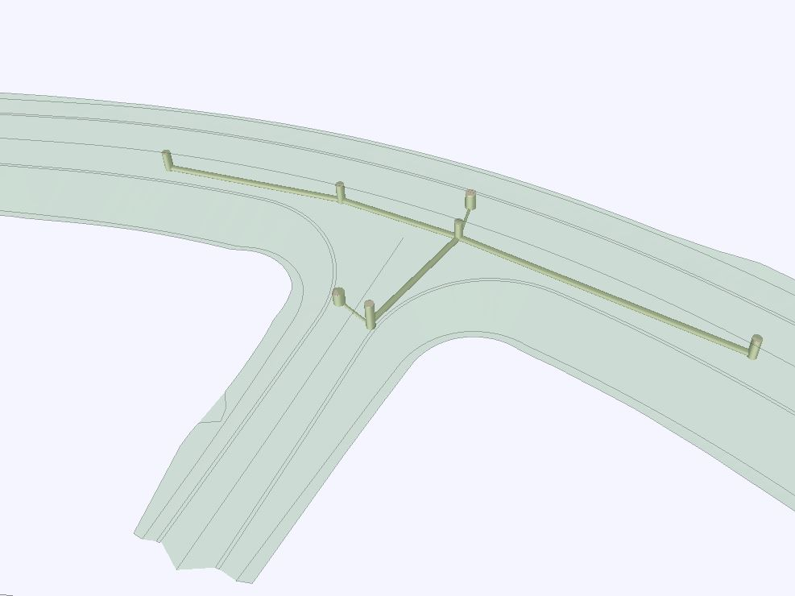

## DrainageSystem_1

### Intent

This UT implements IfcDistributionSystem for road drainage with gullies/manholes and piped sewers.

It is based on storyline bSFi_IR_SLRD-DD (https://app.box.com/s/x9q3q62tcc77hdqpdw0vjncj7bg3byay).

### Prerequisites

This scenario builds upon following other scenarios:
- SpatialStructure_4

### Content

This scenario covers the following concepts and/or IFC entities:
- spatial structure and containment
  - `IfcSite`
  - `IfcRoad`
  - `IfcFacilityPart` with correct `PredefinedType`
  - `IfcRelContainedInSpatialStructure`
  - `IfcRelReferencedInSpatialStructure`
- system structure
  - `IfcDistributionSystem` with correct `PredefinedType`
  - `IfcRelReferencedInSpatialStructure` to assign system to spatial element(s) it services
  - `IfcRelAssignsToGroup` to assign physical elements to the system
  - `IfcRelNests` to relate ports to physical elements
  - `IfcDistributionPort` with correct `PredefinedType` and `FlowDirection`
  - `IfcRelConnectsPorts` 
- physical elements 
  - `IfcDistributionChamberElement` with correct `PredefinedType`
  - `IfcPipeSegment` with correct`PredefinedType`

#### Situation

The start situation is described in the UT SpatialStructure_4 output (SpatialStructure_4.ifc).
In addition, UT_DrainageSystem_1_2.xml provides top surface of road structures for reference.
The drainage system elements are given in UT_DrainageSystem_1_1.xml.

#### Expected Results

Physical elements contained/referenced in the spatial structure set in UT SpatialStructure_4.
Should be visualised correctly compared to the supporting screenshots.
Physical elements grouped into one `IfcDistributionSystem`, which is assigned to `IfcRoad`.
Network topology using `IfcDistributionPort` and `IfcRelConnectsPorts`.

### Supporting files

Following files correspond to this scenario:

| Filename                          | Description                                                    |
|-----------------------------------|----------------------------------------------------------------|
| `UT_DrainageSystem_1_1.xml`       | Inframodel/LandXML: PipeNetwork with Structs and Pipes         |
| `UT_DrainageSystem_1_2.xml`       | Inframodel/LandXML: Top surface of the road and slopes/ditches |
| `UT_DrainageSystem_1_3.jpg`       | Inframodel/LandXML: Screenshot plan view                       |
| `UT_DrainageSystem_1_4.jpg`       | Inframodel/LandXML: Screenshot 3d view                         |
