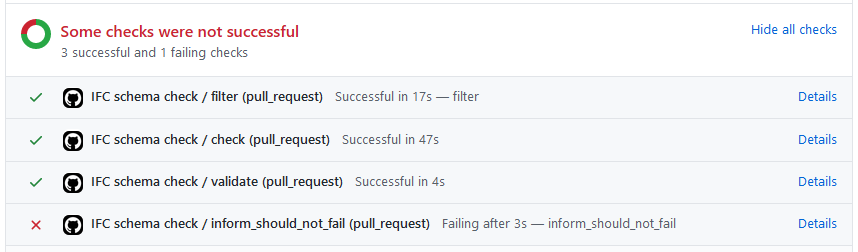

# IFC schema check procedure: documentation

### Trigger

The check is initiated for every pull request.

The procedure checks newly added as well as modified IFC files.

### Steps

First, the pull request is filtered according to the data submitted:
1.  filter
  - filters the pull request for IFC and MD files
The procedure then splits into checking IFCs and MDs separately.

The IFC checking procedure consists of these consecutive steps:
1.  check-ifc
  - runs the checker on filtered IFC files
1.  validate-ifc
  - collects the results from checking
  - uploads the artifacts (see [artifacts](#Artifacts))
1.  inform-ifc
  - informs the user about the results
  - this step fails, if the IFC files do not comply with the schema

The MD checking procedure consists of these steps:
1.  check-md
  - checks the contents of MD files according to the defined rules
1.  inform-md
  - informs the user about the results
  - this step fails, if the MD files do not comply with the guidelines

### Interpretation of results

All steps except the last in each branch should not fail at any point.
If that happens, the checking results are invalid and a further investigation in the checking procedure is needed.
In this case, please open a new issue with the repository.

If the [last IFC checking step](#last) fails as shown below, the IFC files have error(s) in them.
The reason(s) for failing are provided in the `IFC_check_results` [artifact](#Artifacts).

Similarly, if the [last MD checking step](#last-md) fails, the MD files do not comply with the guidelines.
The reason(s) are provided in the `MD_check_result` [artifact](#Artifacts).

If all steps pass successfully, there are:
- no (known) schema issues with the provided IFC files
- no errors in MD files according to the guidelines

### Artifacts

The checking produces two artifacts:
1. a `zip` directory named `IFC_check_results` with the following content:
- `MVDChecker.xsl`: style sheet for XML results
- for each IFC file determined in [filter step](#filter):
  - `<filename>.ifc`: the original IFC file (for your reference)
  - `<filename>.ifc.chkxml`: the XML file containing all errors, warnings, and suggestion as produced by the [checker](#check)
1. a `zip` directory named `MD_check_results` with the following content:
- `log.txt`: text file with error messages from the checking procedure

To visualize the content of the `chkxml` files, use the provided style sheet and a viewer of your choice.
For example, you can:
- use [xsltransform](http://xsltransform.net/), 
- save the resulting HTML to your machine, and 
- study the checking results locally.

### Acknowledgements

This work would not be possible without the awesome checker provided by @arch1501 . Thank you!

The checking procedure was written by @pjanck for the needs of the IFC Infrastructure Extensions Deployment project.
